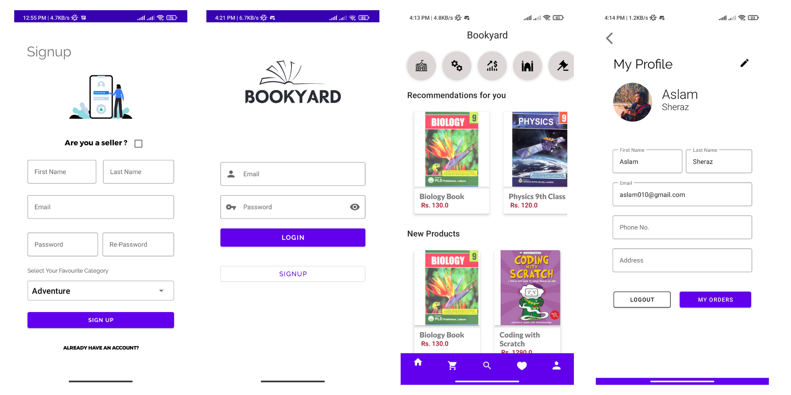
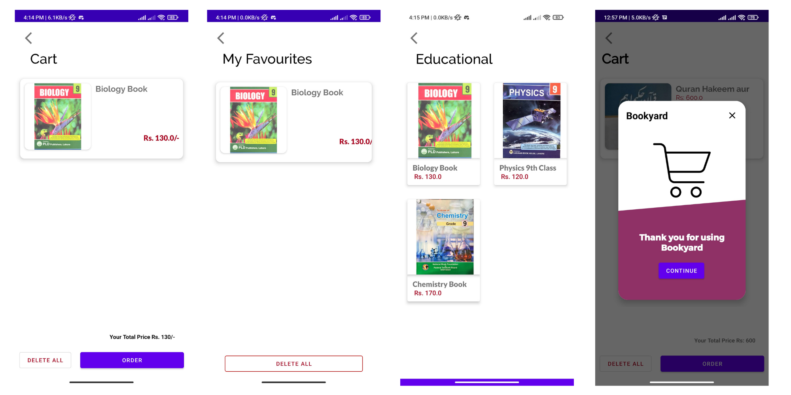
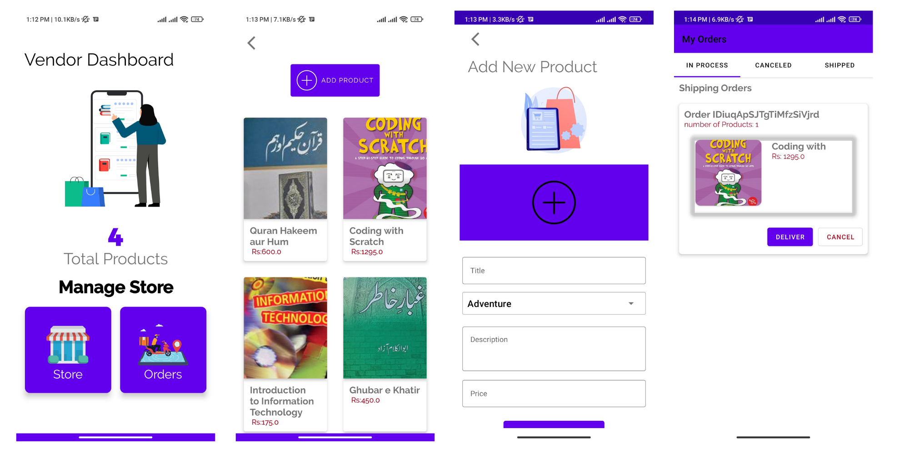

# Bookyard

Bookyard is an online android mobile application where customers can purchase and sell books. It is based on Firebase firestore. This application has vendors and customers as its main user. Bookyard provides a vendor
setup to start his online store in the application after a simple registration. Customers can even surf through the application and look around what are top vendors around them and
what are top-selling books. 
Bookyard is advanced, practical, and full of useful features which will enhance the usability of our application.

## Functions: 
### Customer End:
- Register Page:  (Firebase Authentication)
- Login Page:  Using Email&Password (Firebase Authentication)
- Profile:  Profile Containing Email Address, Name , Address , Phone number 
- Edit Profile: (Ability to update profile)
- Homepage: This is the main page where the newest products are listed, and also the categories.-
- Recommendation Page: Homepage also contain recommendations based on user profiling
- Categories Page: This Page contains all categories of products.
- Cart: (Using TinyDB, based on SharedPreferences)
- My Favourite: My Favourite contain all items that is favourited by customer. (TinyDB)
- Orders: This page shows the shipped, in process and canceled orders.

### Vendor End:
- Register Page:  (Firebase Authentication)
- Login Page:  Using Email&Password (Firebase Authentication)
- Homepage: It contain two button. One for all products and one for all orders
- Profile:  Profile Containing Email Address, Name , Address , Phone number
- Edit Profile: (Ability to update profile)
- Add Product: Vendor can add product with picture and category
- Edit Product: Vendor can edit products
- Order Page: Vendor can ship, cancel and process customer orders. 

